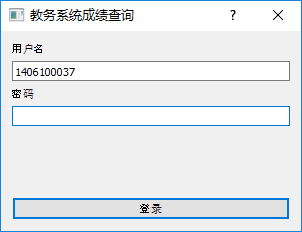
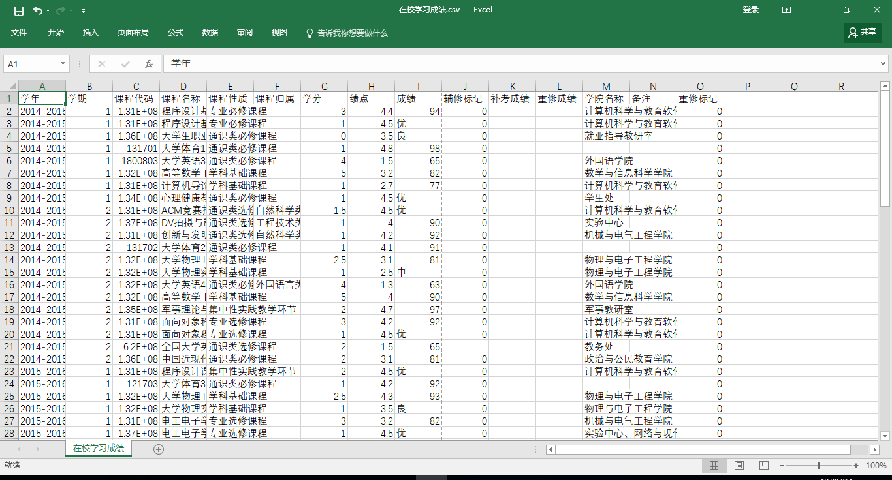

# GzhuGradesCrawler
广州大学教务系统个人在校学习成绩爬虫
## 环境 ##
- 运行 Test 和 GzhuGradesCrawler 中的代码需提前安装好 anaconda2 环境
- 运行 GzhuGradesCrawler3 中的代码需提前安装好 anaconda3 环境
## 功能 ##
- 实现了支持代理、下载限速、数据抓取、下载磁盘缓存、界面交互等功能
## 说明 ##
- Test 中的代码为 version1 的代码，GzhuGradesCrawler 和 GzhuGradesCrawler3 中的代码就是在原来的代码的基础上加以改进得来的，鲁棒性更强。
- 运行 GzhuGradesCrawler 或 GzhuGradesCrawler3 中的 application.py 就可以实现所有的功能。
- 出现登录界面之后，输入数字广大的用户名和密码就可以爬取成绩，最后生成一个"在校学习成绩.csv"。登录界面如下：
- "在校学习成绩.csv"即刚刚输入的用户的在校所有成绩，可用 excel 打开查看。如图：
## 链接 ##
- 作者博客：[http://www.cnblogs.com/jacen789/](http://www.cnblogs.com/jacen789/ "http://www.cnblogs.com/jacen789/")
